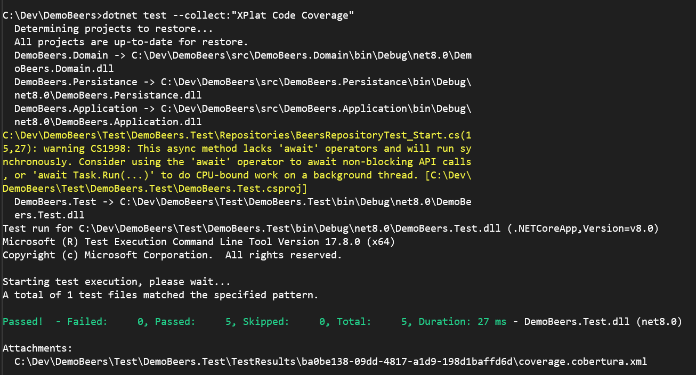
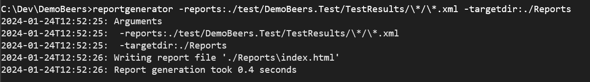
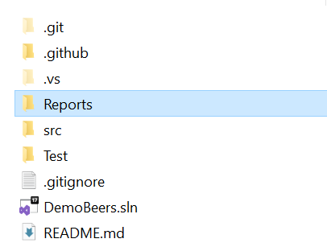
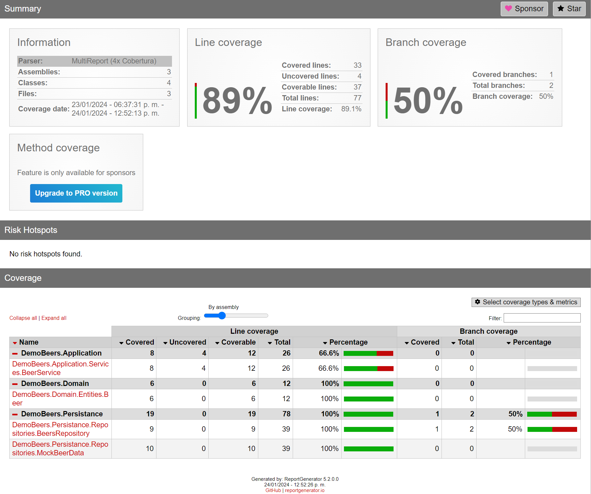

# Demo Beers
<br/>
This application is based on the following template:
https://github.com/jasontaylordev/CleanArchitecture

* [.Net Core 8](https://dotnet.microsoft.com/en-us/download/dotnet/8.0)
* [Xunit](https://www.nuget.org/packages/xunit)

## Overview
This project is part of the Unit Test 101 in .Net Demo. The purpose is to show the basic on how to add Unit Test to your projects. Plus some additional tools to generate the Code Coverage report.

## Getting Started
TODO:

#### Table of Contents

1. [Unit Test](#unittest)

<a name="unittest"></a>
## 3. Unit Test
### Visual Studio
TBD

### Visual Studio Code
In case you are using Visual Studio Code, follow the following steps to generate the Code Coverage report.

1. Install the following tool. Review the official [Nuget page](https://www.nuget.org/packages/dotnet-reportgenerator-globaltool) to get latest:
```
dotnet tool install --global dotnet-reportgenerator-globaltool --version 5.2.0
```

2. Once the tool was instaled, run the following script to generate the Coverlet XML file.
```
dotnet test --collect:"XPlat Code Coverage"
```

You should get an output similar to this:



3. Finally, execute the following script:
```
reportgenerator -reports:./test/Pio.Forecasting.Test/TestResults/\*/\*.xml -targetdir:./Reports
```

You should get an output similar to this:



4. You will see an extra folder on yor solution. Don't worry that folder is not going to be commited. The .gitignore file was modified to avoid that.



5. Navigate to that folder and open up the index.htm file and you will see the Code Coverage Report. Something similar to this:

